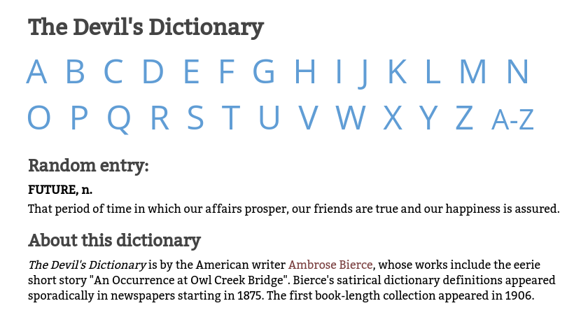

# dictionary-website-boomerang

## A dictionary website implemented with Boomerang

This repository contains a remake of a [dictionary
website](https://github.com/michaellaszlo/dictionary-website-php) that was
written in PHP. The new website is visually and functionally identical to
the old one. The difference is that it was written with the [Boomerang
web template system](https://github.com/michaellaszlo/boomerang), which
uses the [Go language](https://golang.org/).

## Deployment

You must install [Boomerang](https://github.com/michaellaszlo/boomerang)
to build this website.

In addition, you must install the third-party
[sqlite3](https://godoc.org/github.com/mattn/go-sqlite3) Go package:

    go get github.com/mattn/go-sqlite3

To build the dictionary website, navigate to its root directory and run
Boomerang's `buildapp` command.

## Apache configuration

The result of running Boomerang's `buildapp` is an executable `index.cgi`
file. The dictionary website contains this `.htaccess` configuration in
each directory:

    DirectoryIndex /listing/index.cgi
    FallbackResource /listing/index.cgi

You must configure your Apache server to execute `index.cgi`. The exact
configuration depends on your overall environment. This is what I use:

    <VirtualHost *:80>
      ServerName dictionary.mydomain.com
      DocumentRoot /var/www/dictionary
      <Directory /var/www/dictionary/>
        Options -Indexes +ExecCGI
        AddHandler cgi-script .cgi .html
        # required for FallbackResource
        AllowOverride Indexes
      </Directory>
    </VirtualHost>

